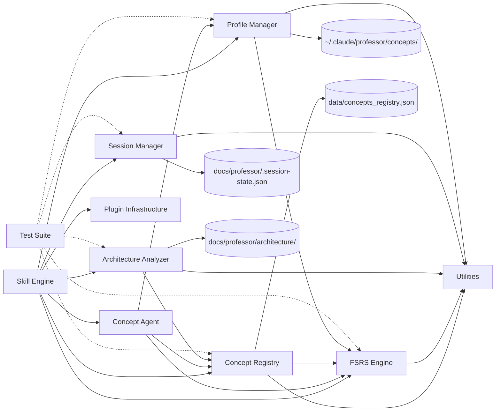
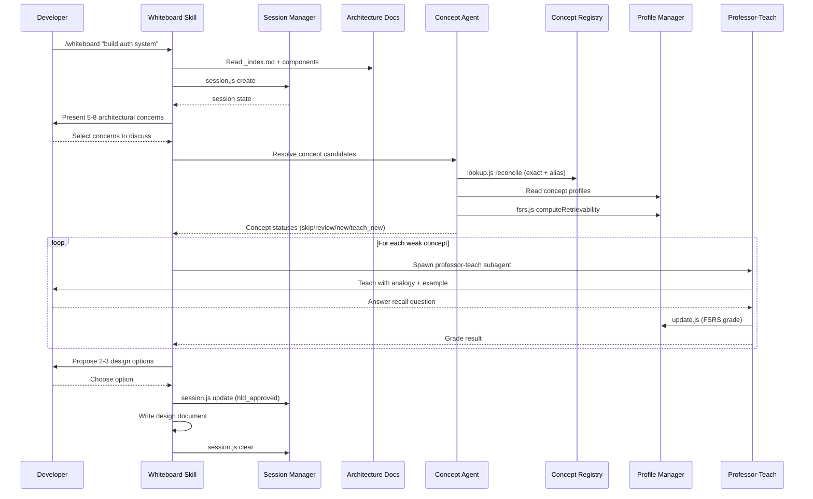
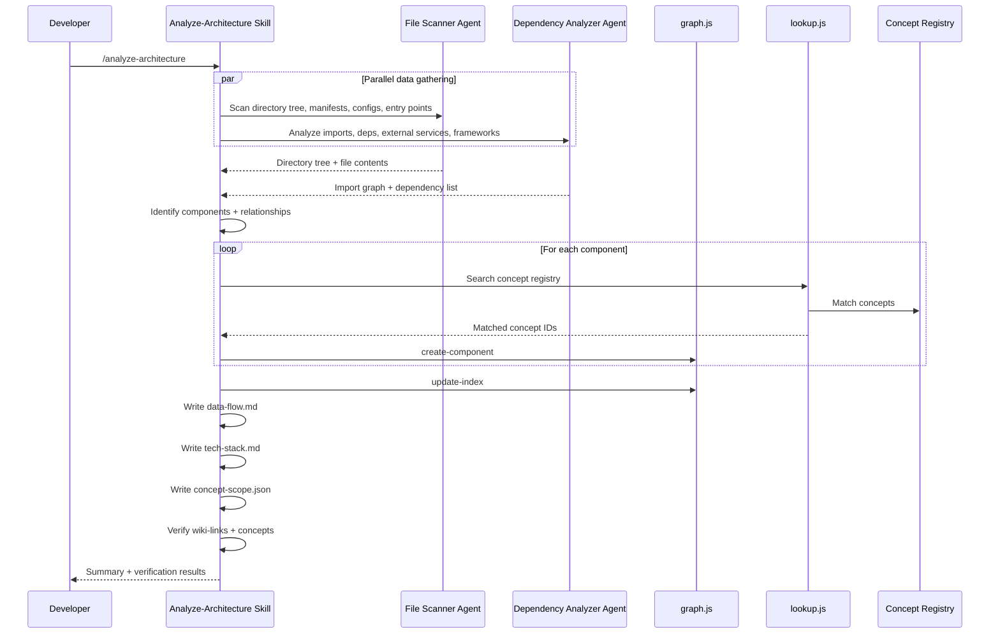

# Data Flow

## Component Dependency Graph

```mermaid
graph LR
    SE[Skill Engine] --> CA[Concept Agent]
    SE --> FE[FSRS Engine]
    SE --> CR[Concept Registry]
    SE --> AA[Architecture Analyzer]
    SE --> SM[Session Manager]
    SE --> PM[Profile Manager]
    SE --> PI[Plugin Infrastructure]

    CA --> CR
    CA --> FE
    CA --> PM

    CR --> FE
    AA --> CR
    PM --> FE

    CR --> UT[Utilities]
    FE --> UT
    AA --> UT
    SM --> UT
    PM --> UT

    TS[Test Suite] -.-> FE
    TS -.-> CR
    TS -.-> AA
    TS -.-> SM
    TS -.-> PM

    PM --> DP[(~/.claude/professor/concepts/)]
    SM --> SF[(docs/professor/.session-state.json)]
    AA --> AD[(docs/professor/architecture/)]
    CR --> RD[(data/concepts_registry.json)]
```

## Sequence: /whiteboard Design Conversation

```mermaid
sequenceDiagram
    participant Dev as Developer
    participant WB as Whiteboard Skill
    participant SM as Session Manager
    participant AA as Architecture Docs
    participant CA as Concept Agent
    participant CR as Concept Registry
    participant PM as Profile Manager
    participant PT as Professor-Teach

    Dev->>WB: /whiteboard "build auth system"
    WB->>AA: Read _index.md + components
    WB->>SM: session.js create
    SM-->>WB: session state

    WB->>Dev: Present 5-8 architectural concerns
    Dev-->>WB: Select concerns to discuss

    WB->>CA: Resolve concept candidates
    CA->>CR: lookup.js reconcile (exact + alias)
    CA->>PM: Read concept profiles
    CA->>PM: fsrs.js computeRetrievability
    CA-->>WB: Concept statuses (skip/review/new/teach_new)

    loop For each weak concept
        WB->>PT: Spawn professor-teach subagent
        PT->>Dev: Teach with analogy + example
        Dev-->>PT: Answer recall question
        PT->>PM: update.js (FSRS grade)
        PT-->>WB: Grade result
    end

    WB->>Dev: Propose 2-3 design options
    Dev-->>WB: Choose option
    WB->>SM: session.js update (hld_approved)
    WB->>WB: Write design document
    WB->>SM: session.js clear
```

## Sequence: /analyze-architecture

```mermaid
sequenceDiagram
    participant Dev as Developer
    participant AA as Analyze-Architecture Skill
    participant FS as File Scanner Agent
    participant DA as Dependency Analyzer Agent
    participant GR as graph.js
    participant LK as lookup.js
    participant CR as Concept Registry

    Dev->>AA: /analyze-architecture
    par Parallel data gathering
        AA->>FS: Scan directory tree, manifests, configs, entry points
        AA->>DA: Analyze imports, deps, external services, frameworks
    end
    FS-->>AA: Directory tree + file contents
    DA-->>AA: Import graph + dependency list

    AA->>AA: Identify components + relationships

    loop For each component
        AA->>LK: Search concept registry
        LK->>CR: Match concepts
        LK-->>AA: Matched concept IDs
        AA->>GR: create-component
    end

    AA->>GR: update-index
    AA->>AA: Write data-flow.md
    AA->>AA: Write tech-stack.md
    AA->>AA: Write concept-scope.json
    AA->>AA: Verify wiki-links + concepts
    AA-->>Dev: Summary + verification results
```
