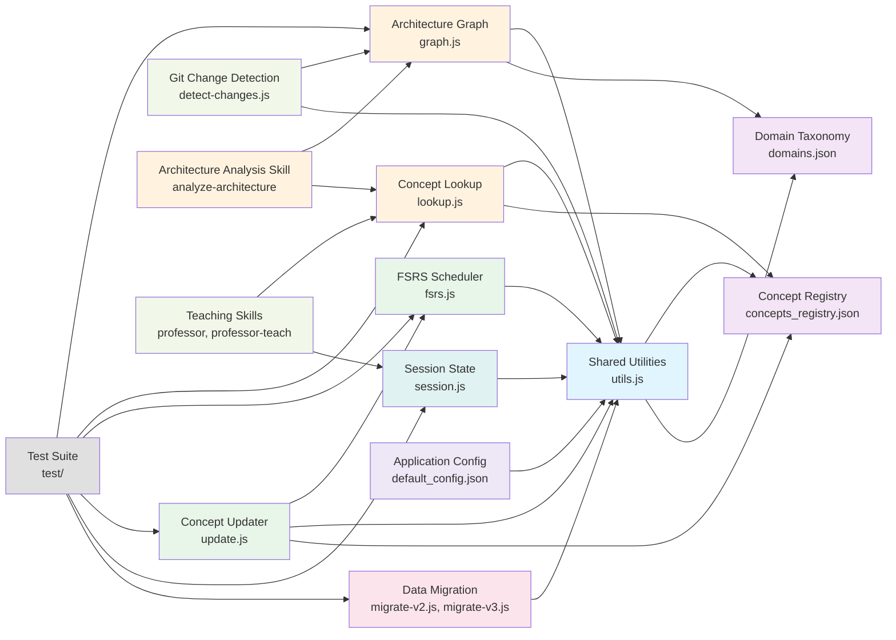
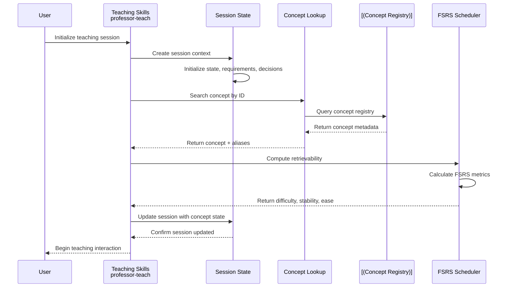
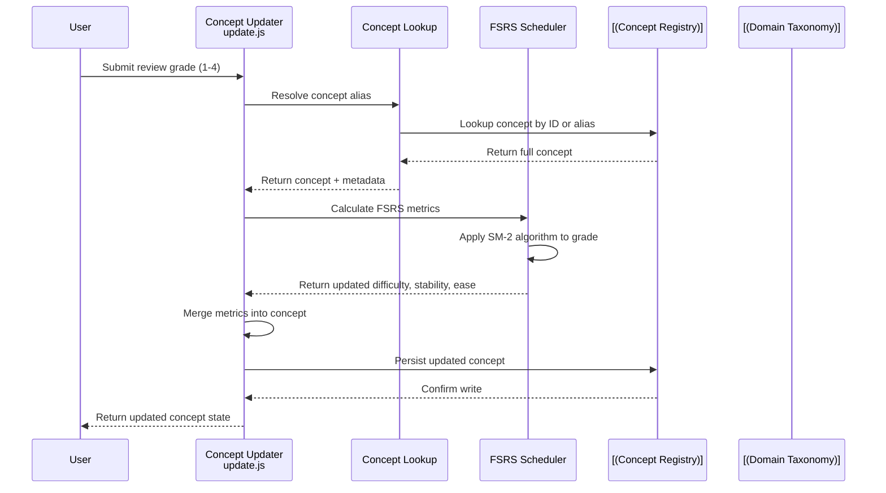
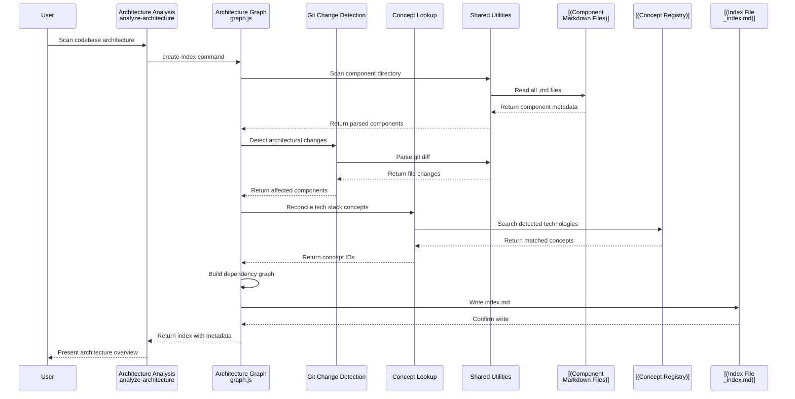

# Data Flow Architecture

## Component Dependency Graph

## Request Flow: Learning Session Initialization

## Request Flow: Concept Update and FSRS Calculation

## Request Flow: Architecture Analysis and Indexing

