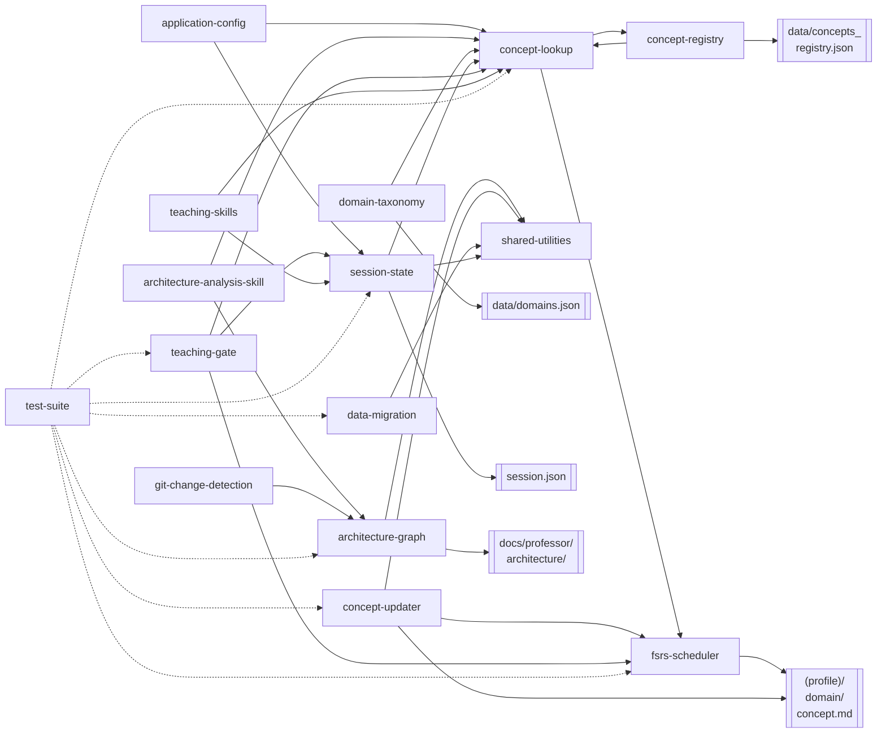
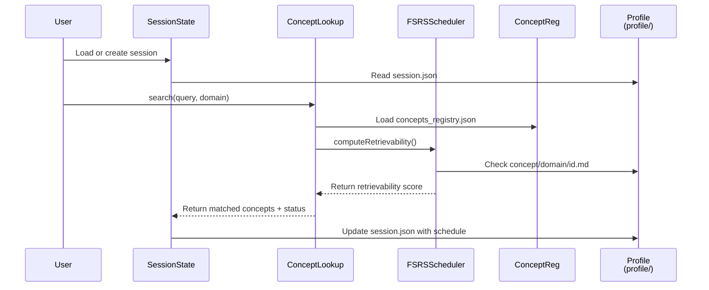
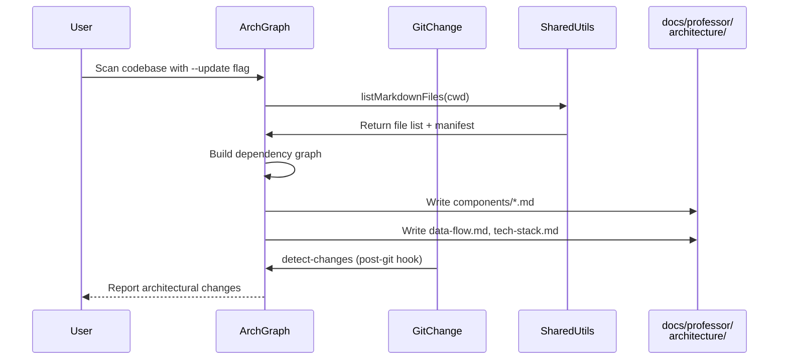
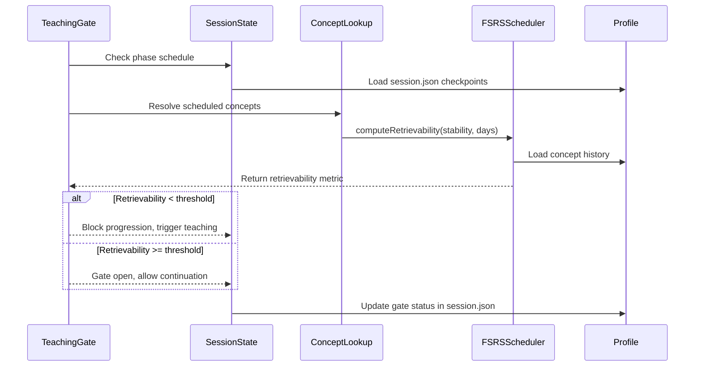

# Data Flow & Architecture

## Component Dependency Graph

## Key Request Flows

### Flow 1: Concept Search & Scheduling

**Trigger**: `/whiteboard` or `/professor-teach` initiates concept resolution

### Flow 2: Architecture Analysis & Detection

**Trigger**: `/analyze-architecture` scans codebase

### Flow 3: Teaching Gate & Session Progression

**Trigger**: Session checkpoint requires concept verification

## Data Models

### Session State Structure

- **Type**: JSON persisted to `~/.claude-professor/profiles/{project}/session.json`
- **Contents**:
  - `sessionId`: UUID for session
  - `phase`: Current phase (clarify, design_hld, design_lld, conclude)
  - `checkpoints`: Map of phase → required concepts
  - `taught`: Set of resolved concept IDs
  - `gates`: Map of phase → open/closed status
  - `updatedAt`: ISO timestamp

### Concept Profile Entry

- **Type**: Markdown with YAML frontmatter
- **Location**: `~/.claude-professor/profiles/{project}/{domain}/{concept_id}.md`
- **Frontmatter Fields**:
  - `stability`: FSRS stability metric (float)
  - `difficulty`: FSRS difficulty rating (1-10)
  - `reps`: Count of reviews
  - `lapses`: Count of failed recalls
  - `lastReview`: ISO timestamp of most recent review

### Architecture Manifest

- **Type**: JSON generated by `architecture-graph`
- **Location**: `docs/professor/architecture/concept-scope.json`
- **Contents**:
  - `relevant_domains`: Inferred domains (e.g., architecture, databases)
  - `tech_stack`: Detected technologies (Node, FastAPI, React, etc.)
  - `detected_patterns`: Observed architectural patterns
  - `generated_from`: Script name or command
  - `last_updated`: ISO timestamp
