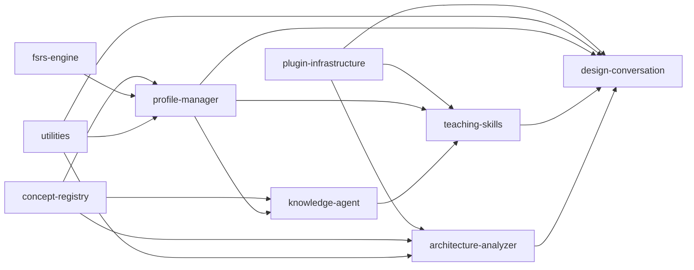
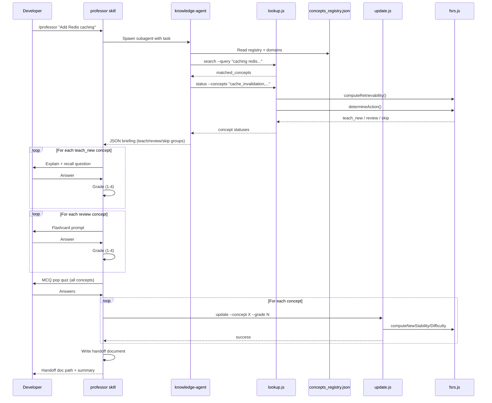
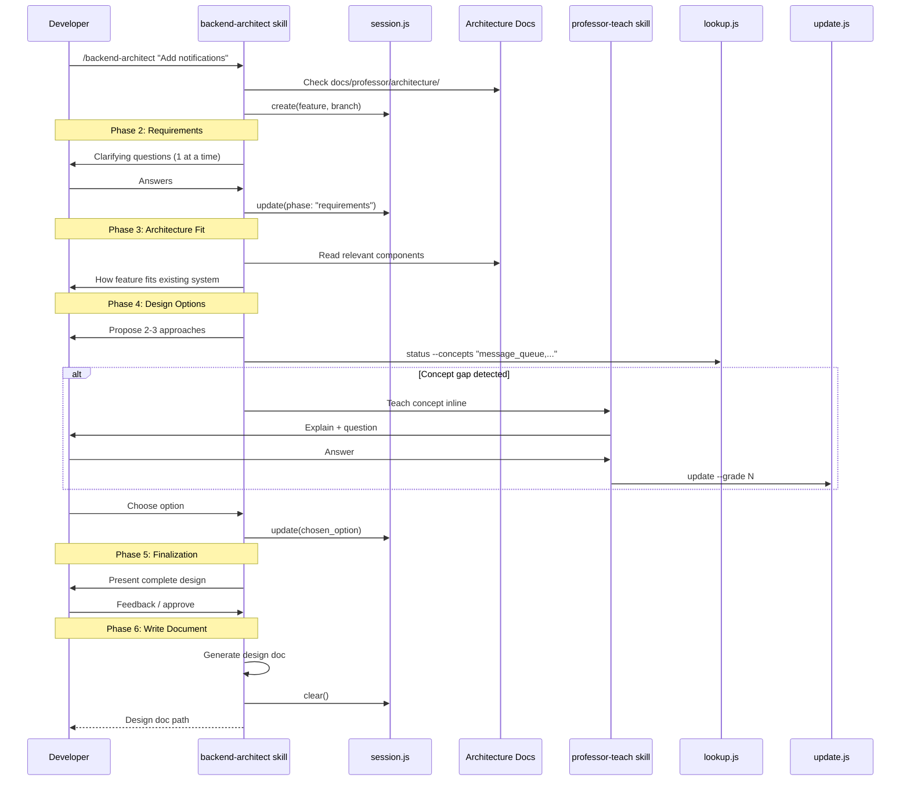
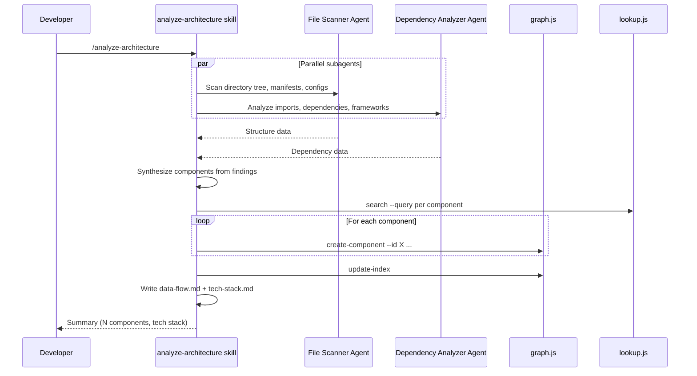

# Data Flow

## Component Dependency Graph

## Key Request Flows

### 1. `/professor {task}` — Teaching Flow

### 2. `/backend-architect {feature}` — Design Conversation Flow

### 3. `/analyze-architecture` — Architecture Scan Flow

