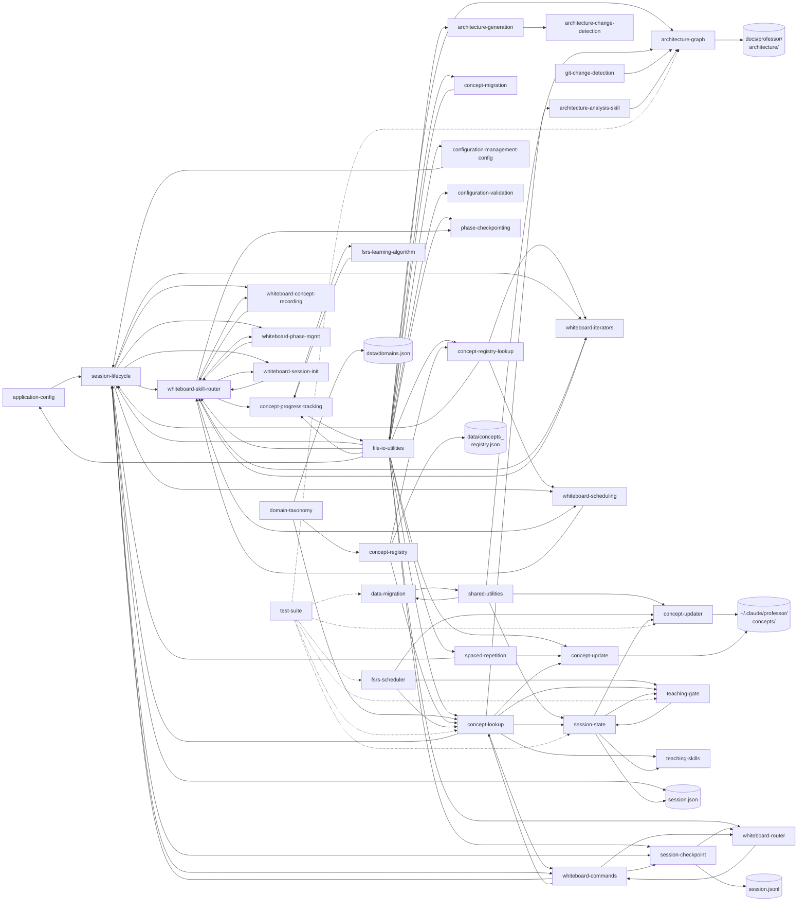
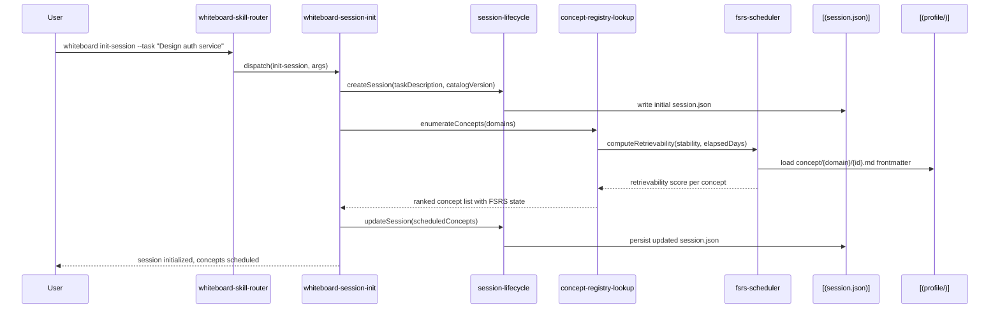
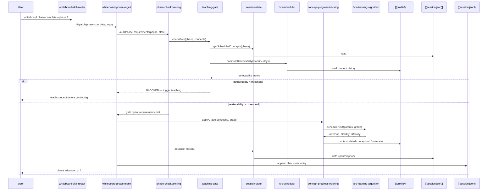
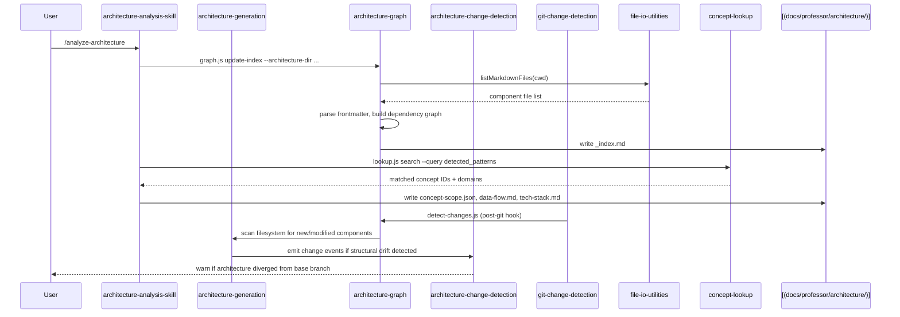

# Data Flow & Architecture

## Component Dependency Graph

## Key Request Flows

### Flow 1: Whiteboard Session Init & Concept Scheduling

**Trigger**: `whiteboard init-session` — user begins a design session via the v5 skill router

### Flow 2: Phase Progression & Teaching Gate

**Trigger**: `whiteboard phase-complete` — user requests advancement to next phase

### Flow 3: Architecture Analysis & Index Update

**Trigger**: `/analyze-architecture` or git post-hook — codebase is scanned and docs updated

## Data Models

### Session State Structure

- **Type**: JSON persisted to `~/.claude/professor/sessions/{project}/session.json`
- **Key Fields**:
  - `sessionId`: UUID for session
  - `phase`: Current phase (`clarify`, `design_hld`, `design_lld`, `conclude`)
  - `checkpoints`: Map of phase to required concept IDs
  - `taught`: Set of resolved concept IDs
  - `gates`: Map of phase to open/closed status
  - `updatedAt`: ISO timestamp

### Concept Profile Entry

- **Type**: Markdown with YAML frontmatter
- **Location**: `~/.claude/professor/concepts/{domain}/{concept_id}.md`
- **Frontmatter Fields**:
  - `stability`: FSRS stability metric (float)
  - `difficulty`: FSRS difficulty rating (1–10)
  - `reps`: Count of reviews
  - `lapses`: Count of failed recalls
  - `lastReview`: ISO timestamp of most recent review

### Architecture Manifest

- **Type**: JSON generated by `architecture-graph`
- **Location**: `docs/professor/architecture/concept-scope.json`
- **Key Fields**:
  - `relevant_domains`: Inferred knowledge domains
  - `tech_stack`: Detected technologies
  - `detected_patterns`: Observed architectural concept IDs
  - `generated_from`: Source script or command
  - `last_updated`: ISO timestamp
