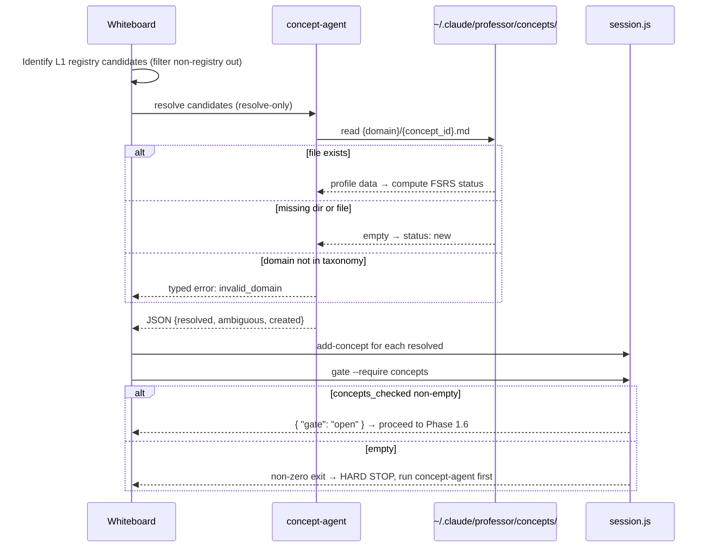

# Design: Patch 3.2.0 — Protocol Compliance and Concept-Agent Path Fix

## Date
2026-04-10

## Status
Approved

## Original Request
Three fixes identified from whiteboard usage at 60% effectiveness:
1. LLM skips concept-agent entirely based on implicit proficiency assumptions — knowledge graph never populated
2. Whiteboard submits non-L1 / non-registry candidates in Phase 1 (spaced_repetition, retrievability, knowledge_graph had no registry entries)
3. Concept-agent profile lookup ignores domain subdirectory — always returns `new` even when a profile exists

## Architecture Context
14 components. Affected:
- **teaching-skills** — whiteboard SKILL.md, concept-check protocol (Fixes 1 and 2)
- **concept-lookup** — agents/concept-agent.md (Fix 3)
- **session-state** — scripts/session.js (Fix 2: new gate command)

Existing constraints:
- concept-agent is LLM-interpreted — enforcement cannot rely on prose alone
- Profile files stored at `~/.claude/professor/concepts/{domain}/{concept_id}.md` — domain subdir is mandatory
- session.js is the authoritative state store; all phase transitions route through it
- v3.1.0 self-healing retry protocol (systemic vs input-specific circuit breaker) is in place and must be preserved

## Requirements

### Functional
- Concept-agent must resolve profile path as `{profile_dir}/{domain}/{concept_id}.md`
- Missing domain dir or concept file on read → status `new` (not a typed error)
- Typed error only when domain is not in the 18-domain taxonomy
- Lazy `mkdir -p` on write before creating a concept file
- Whiteboard Phase 1.4 candidates must be registry-resolvable L1 seed concepts only
- Whiteboard must call `session.js gate --require concepts` before Phase 1.6 (requirement discussion) and before Phase 2.1 (design proposals)
- Gate returns error if `concepts_checked` is empty — LLM must not proceed
- Gate infra failure (script error unrelated to empty concepts) → warn and continue

### Non-Functional
- Scale: no new load — gate is a local file read
- Latency: gate adds one script call (~50ms) per phase boundary
- Reliability: gate failure must not hard-crash the session; graceful degradation to warn-and-continue
- Security: no new attack surface

## Design

### Overview

Three targeted changes, each confined to one file or script, applied in dependency order.

**Fix 3 (prerequisite):** concept-agent's Compute Status step is wrong — it constructs the profile path without the domain subdirectory. The fix is a one-line path correction. The broader error model simplifies: missing dir and missing file both mean `new` on read; lazy dir creation on write means the system self-heals the directory structure. Typed errors are reserved for genuinely invalid states (unknown domain).

**Fix 2 (structural gate):** A new `gate` command in session.js checks `concepts_checked` length. The whiteboard skill calls it at two boundaries — before discussing any requirement in depth (Phase 1.6) and before proposing design options (Phase 2.1). The gate turns "the LLM should check concepts first" from prose guidance into a script-enforced checkpoint. Bypassing it requires actively ignoring a returned error, which is harder to rationalize than skipping a narration step. This was validated empirically — prompt-level enforcement failed multiple times during the design session itself.

**Fix 1 (skill text discipline):** Phase 1.4 gets an explicit filter rule: candidates must be resolvable L1 seed concepts from the registry. Non-registry candidates (spaced_repetition, retrievability, knowledge_graph) are not submitted to concept-agent — they have no match and cannot be resolved. The rule is enforced at the identification step, before concept-agent is called.

### Component Changes

- **agents/concept-agent.md**: Compute Status step — change path from `{profile_dir}/{concept_id}.md` to `{profile_dir}/{domain}/{concept_id}.md`. Add: missing dir or file → status `new`. Add: on write, run `mkdir -p` before file creation. Add: typed error case for domain not in taxonomy.
- **scripts/session.js**: Add `gate` subcommand. Accepts `--require concepts`. Reads session state, checks `concepts_checked.length > 0`. Returns `{ "gate": "open" }` on pass, exits non-zero with `{ "gate": "blocked", "reason": "concepts_checked is empty" }` on fail.
- **skills/whiteboard/SKILL.md**: Phase 1.4 — add filter rule (L1 registry-resolvable only). Phase 1.6 and Phase 2.1 — add mandatory gate call with hard-stop instruction on non-zero exit.

### Data Flow

### Key Decisions

| Decision | Chosen | Over | Reasoning |
|----------|--------|------|-----------|
| Gate enforcement mechanism | session.js script | Prompt-only narration | Empirically proven: LLM bypassed prompt-level rules multiple times during design session; script error is harder to rationalize around |
| Continuous gate | Before 1.6 AND 2.1 | Once at 1→2 boundary only | Design discussion before concept check breaks the lazy-learning pattern; any in-depth requirement discussion must be preceded by concept verification |
| Missing dir on read | Status `new`, no error | Typed error for missing dir | Dir is lazily created on write; missing dir on read just means nothing has been written yet — identical to missing file |
| Typed error scope | Invalid domain only | Any path failure | Invalid domain is a logic error (unknown taxonomy entry); missing paths are normal `new` state |
| Fix 3 as prerequisite | Implement first | Parallel with other fixes | Fixes 1 and 2 depend on concept-agent returning correct statuses; path bug causes false `new` for all known concepts, making gate and filter meaningless |

### Edge Cases & Failure Modes

- **Gate script infra failure** (non-gate logic error): warn developer, continue session — don't block on infra noise
- **concept-agent returns all `ambiguous`** (no registry matches): gate will block since nothing lands in `concepts_checked`. Whiteboard must surface the ambiguity to developer before re-submitting refined candidates
- **Domain not in taxonomy**: typed error surfaced to whiteboard, which warns developer and skips that candidate — does not block the session
- **Empty candidate list** (developer describes a feature with no resolvable L1 concepts): gate blocks. Whiteboard asks developer to name the technical patterns involved before proceeding

## Risk Records

| Risk | Severity | Mitigation | Accepted By |
|------|----------|------------|-------------|
| Gate adds friction for sessions where concepts genuinely don't apply | Low | Infra-failure fallback (warn and continue) covers transient cases; developer can name "N/A" concepts if truly none apply — not currently scoped | Developer |
| L1-only filter may exclude valid intermediate candidates that aren't in registry | Low | Deferred: difficulty-tier filter and __index__.md domain-level tracking are patch 3.3.0 concerns | Developer |

## Concepts Covered

- `pipe_filter` (architecture): known, R=0.978 — whiteboard phases as enforced pipeline
- `input_validation` (security): known, R=0.994 — filtering L1-only candidates at boundary
- `defensive_programming` (software_construction): taught, grade 2/4 — validate at trust boundaries; mode-specific response (typed error vs create) to be reinforced
- `error_handling` (programming_languages): taught, grade 3/4 — missing file vs missing dir distinction; recovery path divergence
- `fault_tolerance` (reliability_observability): taught, grade 4/4 — circuit breaker scoped by error type; connected to v3.1.0 self-healing retry protocol
- `circuit_breaker` (reliability_observability): known, grade 4 from v3.1.0 session — systemic vs input-specific classification

## Concepts to Explore During Implementation

- `test_driven_development`: gate command in session.js should have unit tests verifying open/blocked behavior before shipping
- `integration_testing`: end-to-end test of full Phase 1 flow with gate to verify concept-agent → session state → gate → proceed chain

## Migration & Rollback

- No profile file format changes — existing profiles at `{domain}/{concept_id}.md` are already in the correct structure
- No session state schema changes — gate reads existing `concepts_checked` field
- Rollback: revert three files (concept-agent.md, session.js, whiteboard SKILL.md). No data migration needed.

## Observability

- Gate blocked events: session state records phase transitions — a session stuck at `requirements` phase with empty `concepts_checked` indicates gate is working
- Path lookup correctness: after Fix 3, run `lookup.js status` on a known concept (circuit_breaker) and verify it returns `skip` not `new`
- Smoke test: invoke whiteboard on a trivial feature, verify concept-agent is called before Phase 1.6 begins
