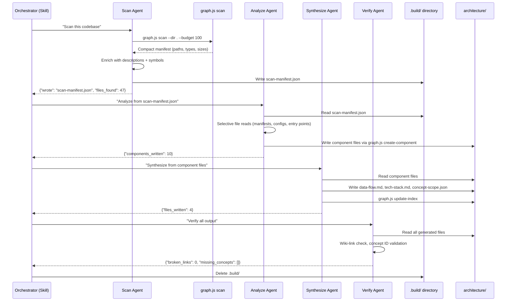
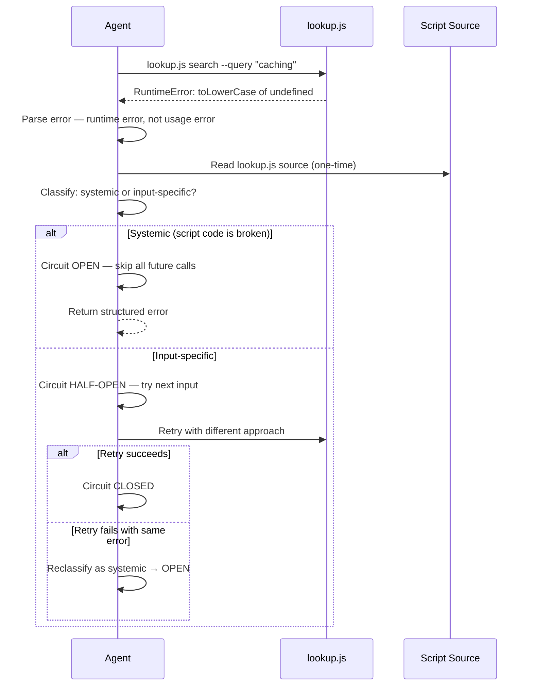

# Design: v3.1 Context-Efficient Pipeline & Script Fixes

## Date
2026-04-10T07:30:00Z

## Status
Proposed

## Original Request
Both `/whiteboard` and `/analyze-architecture` hit "Extra usage is required for 1M context" errors. The analyze-architecture skill dispatches two parallel subagents that return full file contents, blowing up context. lookup.js search is broken due to stale v2 field references. Scripts and skill text reference `id` instead of `concept_id`. Whiteboard silently skips concept tracking when the model assumes developer expertise. Need resolution as a v3.1 plugin update.

## Architecture Context
claude-professor is a Claude Code plugin with 10 components. The skill-engine orchestrates multi-agent design conversations via whiteboard and codebase analysis via analyze-architecture. Both skills rely on scripts (lookup.js, graph.js, session.js) that run as CLI commands. The concept-agent subagent resolves concepts against a 407-entry seed registry using lookup.js. All scripts use Node.js built-ins only — zero external dependencies.

Affected components: skill-engine, architecture-analyzer, concept-registry, concept-agent, utilities, test-suite, plugin-infrastructure.

Existing constraints:
- Zero external dependencies (Node.js built-ins only)
- Plugin cache is read-only — agents cannot fix scripts at runtime
- Claude Code subagents don't carry forward context between each other
- No `npm install` step during plugin installation

## Requirements

### Functional
- analyze-architecture must complete within standard context limits (no 1M requirement)
- lookup.js search must work with v3 registry format (concept_id field)
- Whiteboard must always resolve concepts through concept-agent, never skip
- Script outputs must be compact — return only fields consumed downstream
- Agents must self-heal on script failures with retry and circuit breaker logic

### Non-Functional
- Scale: must handle codebases up to 200+ files without context overflow
- Latency: pipeline stages run sequentially — acceptable tradeoff for bounded context
- Reliability: self-healing retry prevents script bugs from becoming user-visible failures
- Token budget: scan manifest under 2KB for fixture project, proportional growth for larger projects

## Design

### Overview
Replace analyze-architecture's 2-parallel-agent architecture with a 4-stage file-mediated pipeline (scan → analyze → synthesize → verify). Each stage writes output to `docs/professor/architecture/.build/` and returns a small status JSON to the orchestrator. The orchestrator context never sees raw codebase data.

Add self-healing retry to all agent script calls: usage errors retry freely, runtime errors get 2 retries with an LLM-driven circuit breaker that classifies failures as systemic (OPEN — stop all calls) or input-specific (HALF-OPEN — probe next call). Default to HALF-OPEN for ambiguous errors.

Fix lookup.js search bug, change all script outputs to compact format (only fields consumed downstream), and add a concept-tracking mandate to whiteboard.

### Component Changes

- **analyze-architecture skill** (rewrite): 4-stage file-mediated pipeline replacing 2-parallel-agent approach. Stages communicate via `.build/` directory. Orchestrator receives only status JSON per stage. Fix `id` → `concept_id` in skill text (lines 74, 142).

- **graph.js** (new command): `scan` command — deterministic filesystem walk returning paths, types, sizes, language classification. Agent layer enriches with descriptions and symbols via schema-constrained output. Schema validation normalizes LLM output, regex fallback if LLM fails.

- **lookup.js** (bug fix + output change): Fix `concept.id` → `concept.concept_id` (line 16). Drop `|| entry.id` fallback (line 101). Change `search` default output to compact: concept_id + domain only. Change `status` default output to compact: concept_id + domain + status + retrievability only.

- **concept-agent** (resilience): Add self-healing retry protocol with LLM-driven circuit breaker. Usage errors retry freely. Runtime errors: 2-retry cap, classify systemic vs input-specific, HALF-OPEN default for ambiguous errors.

- **whiteboard skill** (constraint): Add rule: "Always resolve concept candidates through concept-agent. Never skip based on assumed expertise. Record `known` status for concepts with R > 0.7."

- **test-suite** (fixes + new): Update lookup.test.js to v3 format. Move test data to `tests/data/` fixture directory. New `tests/cli/test-analyze-architecture.sh` with controlled baseline assertions.

### Data Flow

**analyze-architecture pipeline (new):**



**Self-healing retry flow:**



### Scan Manifest Format

```json
{
  "project_root": "/path/to/project",
  "scan_budget": 100,
  "files": [
    {
      "path": "scripts/lookup.js",
      "language": "js",
      "type": "source",
      "exports": ["search", "status", "reconcile", "listConcepts"],
      "description": "Concept registry lookup and search operations"
    }
  ],
  "directories": [
    { "path": "scripts/", "file_count": 12, "description": "Core logic and utilities" }
  ],
  "total_files": 47,
  "truncated": false
}
```

Schema enforcement:
- `language`: enum (js|ts|py|go|rs|java|rb|php|other)
- `type`: enum (manifest|config|source|test|docs|other)
- `exports`: normalized bare names (no parens), deduplicated
- `description`: max 12 words
- Post-processing script normalizes LLM output, regex fallback if LLM fails
- Empty `files` array → fail open (scan everything up to budget)

### Key Decisions

| Decision | Chosen | Over | Reasoning |
|----------|--------|------|-----------|
| Pipeline architecture | File-mediated 4-stage | 2-parallel-agent, single monolithic agent | Bounded context at every stage, staged testability, progress visibility. Sequential is slower but guaranteed to complete. |
| Context carry-forward | Disk files (.build/ directory) | Orchestrator relay, shared memory | Subagents can't share context directly. Disk files keep orchestrator context clean. |
| Script output format | Compact by default | Verbose with --compact flag | No consumer uses verbose output. Don't build for hypothetical future use. Add --verbose later if needed. |
| Symbol extraction | Deterministic script + LLM enrichment | LLM-only, AST parser, ctags | Zero-dependency constraint rules out external tools. Script provides deterministic base, LLM adds intelligence. Three-layer validation handles LLM inconsistency. |
| LLM consistency | Schema + normalization + fallback | Prompt instructions alone | Prompts are guidelines not guarantees. Deterministic post-processing is the enforcement layer. |
| Retry strategy | Usage: unlimited. Runtime: 2-cap + circuit breaker | Fixed retry count for all errors, no retry | Different error classes need different treatment. LLM can reason about error type unlike traditional circuit breakers. |
| Circuit breaker default | HALF-OPEN for ambiguous errors | OPEN for ambiguous | Cost of one extra probe (~200 tokens) < cost of wrongly blocking valid calls. Fail open, rely on downstream guards. |
| Backward compat | Drop v2 `id` field support entirely | Keep `concept_id \|\| id` fallback | v2 format is dead. Fallbacks for deleted formats add complexity and mask bugs. |
| Concept tracking | Mandatory in whiteboard, not in analyze-architecture | Optional based on model judgment | Whiteboard users expect knowledge tracking. Analyze-architecture is structural, not a teaching session. |
| Test data | Fixture directory (tests/data/) with controlled baselines | Inline test data, production data | Deterministic baselines enable exact assertions. Shared fixtures eliminate test data duplication. |

### Edge Cases & Failure Modes

- **Scan agent crashes**: No `.build/scan-manifest.json` written. Orchestrator sees no status response. Retry the scan stage once, then report failure.
- **Analyze agent writes partial components**: Verify stage catches broken wiki-links and reports them. Orchestrator can re-run analyze from existing scan manifest.
- **lookup.js fails for specific domain**: Circuit breaker goes HALF-OPEN, probes next concept. If systemic, goes OPEN and propagates structured error with full error chain.
- **LLM returns malformed manifest JSON**: Post-processing script validates schema, rejects invalid entries, falls back to regex extraction for symbol data.
- **Empty scan_targets from LLM**: Normalized to "scan everything" (fail open), budget cap prevents context overflow.
- **Fixture project changes break baseline tests**: Tests assert against known fixture content — any fixture change requires updating baseline assertions.

## Risk Records

| Risk | Severity | Mitigation | Accepted By |
|------|----------|------------|-------------|
| Sequential pipeline slower than parallel | Low | Architecture analysis is run-once-per-project. 30s extra is acceptable for reliability. | Developer |
| LLM-driven circuit breaker misclassifies error | Medium | 2-retry hard cap bounds worst case. HALF-OPEN default limits unnecessary blocking. | Developer |
| Scan manifest grows large on huge codebases | Medium | Budget cap with truncation flag. Prioritize manifests > configs > entry points > other source. | Developer |
| Regex fallback misses language-specific exports | Low | Fallback is better than nothing. Agent enrichment handles the 80% case. | Developer |
| .build/ directory left behind on crash | Low | Verify stage or next run cleans up. Not user-facing data. | Developer |

## Concepts Covered

- `pipe_filter`: taught — 4-stage file-mediated pipeline for analyze-architecture. Atomic writes prevent corrupt intermediate files. Grade: 3 (Good)
- `input_validation`: taught — schema validation at agent trust boundary. Three-layer enforcement: schema constraints, deterministic normalization, regex fallback. Fail-open with budget as safety net. Grade: 4 (Easy)
- `circuit_breaker`: taught — LLM-driven circuit breaker for agent script calls. Debug-driven reasoning classifies systemic vs input-specific. HALF-OPEN default for ambiguous. Grade: 4 (Easy)
- `coupling_cohesion`: known — plugin author, system designer
- `defensive_programming`: known — error handling design
- `design_patterns`: known — orchestrator-subagent patterns

## Concepts to Explore During Implementation

- `idempotent_operations`: relevant when re-running pipeline stages from existing .build/ state — each stage should produce identical output given identical input
- `schema_evolution`: relevant if scan manifest format changes between versions — how to handle old .build/ files

## Migration & Rollback

- **Migration**: v3.0.0 → v3.1.0. No user data migration needed — changes are to scripts, skills, and tests only. User concept profiles (FSRS data) are unaffected.
- **Rollback**: Revert to v3.0.0 plugin. All generated architecture files remain valid. `.build/` directory can be deleted manually if present.
- **Data compatibility**: lookup.js drops `id` field support. Any external tooling reading search output must use `concept_id`. No known external consumers.

## Observability

- Self-healing retry errors are captured in structured error JSON returned to orchestrator
- Circuit breaker state transitions (CLOSED → HALF-OPEN → OPEN) logged in agent output
- Scan manifest includes `truncated` flag — visible to analyze agent and in verify output
- Budget assertions in CLI tests catch output size regressions before release

## Implementation Checklist

### Phase 1: Bug Fixes (no architecture changes)
- [ ] Fix lookup.js line 16: `concept.id` → `concept.concept_id`
- [ ] Fix lookup.js line 101: drop `|| entry.id` fallback
- [ ] Fix analyze-architecture SKILL.md lines 74, 142: `id` → `concept_id`
- [ ] Update lookup.test.js: v3 format test registry
- [ ] Update lookup-v3.test.js line 322: `c.id` → `c.concept_id`
- [ ] Run all tests, verify green

### Phase 2: Compact Outputs
- [ ] Change lookup.js search output to compact (concept_id + domain only)
- [ ] Change lookup.js status output to compact (concept_id + domain + status + retrievability)
- [ ] Update tests for new output format
- [ ] Create tests/data/ directory with fixture-project and registry-v3.json

### Phase 3: Pipeline Architecture
- [ ] Implement graph.js scan command (deterministic file walk + classification)
- [ ] Implement schema validation and normalization in graph.js
- [ ] Rewrite analyze-architecture SKILL.md to 4-stage pipeline
- [ ] Create tests/cli/test-analyze-architecture.sh with baseline assertions
- [ ] Test pipeline on claude-professor's own codebase

### Phase 4: Agent Resilience
- [ ] Add self-healing retry protocol to concept-agent.md
- [ ] Add circuit breaker classification logic to agent prompt
- [ ] Add concept-tracking mandate to whiteboard SKILL.md
- [ ] Test whiteboard concept resolution flow

### Phase 5: Release
- [ ] Bump version to 3.1.0 in plugin.json and marketplace.json
- [ ] Run full test suite
- [ ] Run analyze-architecture on own codebase — verify completes without 1M context
- [ ] Run whiteboard session — verify concept tracking works
