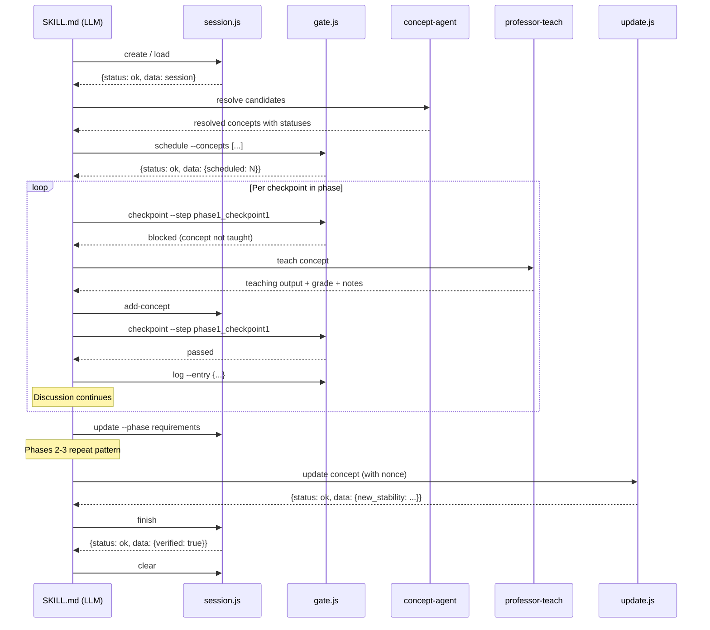

# Design: claude-professor v4.0.0 — Quality Architecture

## Date
2026-04-11

## Status
Proposed

## Original Request
I made this plugin as my first plugin. But I can still see a lot of quality issues compared to plugins like superpowers or pr-review-toolkit or everything-claude-code which are industry standard widely accepted. I want to improve the plugin quality in version 4.0.0, so that the future patches are minor quality improvements for response and agents and not the architecture and design itself.

## Architecture Context

claude-professor is a learning layer plugin for Claude Code with 14 components: session management, concept lookup, FSRS scheduling, architecture analysis, teaching skills, and supporting utilities. The plugin tracks developer knowledge via spaced repetition and teaches concepts during design sessions.

Key constraints shaping v4.0.0:
- LLMs optimize for forward momentum over protocol compliance (proven in v3.2.0 — 60% compliance rate with prompt-level enforcement)
- Script-enforced structural gates are the only reliable enforcement mechanism
- The execute phase (design discussion) is non-deterministic and conversational — cannot be controlled by a state machine
- Subagent calls (concept-agent, professor-teach) are LLM-based and subject to intermittent failure

### Components Affected
- `session.js` — enhanced (+finish, -gate)
- `lookup.js`, `update.js`, `graph.js` — envelope standardization
- All SKILL.md files — rewritten to follow template
- `professor-teach` skill — structured output contract + adaptive re-teaching
- `concept-check protocol` — references gate.js instead of session.js gate

### New Components
- `gate.js` — teaching schedule, checkpoint enforcement, session logging
- `migrate-v4.js` — incremental v3→v4 migration
- SKILL.md template — structural contract for all skills
- Concept file schema v4 — rich markdown notes, operation nonce, schema version

## Requirements

### Functional
1. **Strict skill contracts** — every skill declares inputs, outputs, failure modes, and lifecycle phases via template frontmatter
2. **Teaching schedule enforcement** — concept-agent results stored as a schedule, gate.js checkpoint blocks if scheduled concepts aren't taught at their assigned step
3. **Structured error model** — all scripts return `{status, data, error}` with three-tier error levels (fatal/blocking/warning) and mutual exclusion
4. **Session-log as narrative context** — append-only JSONL file serving as context source for `--continue` resume
5. **Idempotent FSRS updates** — operation nonce in concept files prevents double-grading on retry
6. **Incremental migration** — v3 profiles work immediately on v4 install, lazy upgrade on first write, optional batch via script or `--promote`
7. **Rich teaching notes** — professor-teach writes structured markdown notes to concept file body; reads prior notes on re-encounter to adapt teaching
8. **Structured teaching output** — analogy, real-world example, task connection, recall question — every time

### Non-Functional
- **Reliability**: warn-and-degrade on subagent failure, never silent data loss
- **Compatibility**: minor/patch versions preserve session state, profiles, and skill contracts; only major versions may break
- **Testability**: three-tier test pyramid — unit (existing), contract (new, one per script), integration (new, 2-3 chain tests)
- **Observability**: session-log for post-mortem debugging, minimal by default

## Design

### Overview

v4.0.0 introduces a **session manager + gate service** architecture. `session.js` (already the lifecycle manager) gains a `finish` subcommand for verified teardown. A new `gate.js` script provides teaching schedule storage, per-step checkpoint enforcement, and append-only session logging. The skill drives its own conversational flow during the execute phase and calls gate.js at step boundaries for structural enforcement.

This architecture was selected over three alternatives:
- **Full lifecycle engine** (Option A) — rejected because the execute phase is non-deterministic; an FSM cannot direct LLM conversation
- **Lifecycle engine with two modes** (Option A') — rejected because bookend operations (start/finish) are already handled by session.js; a new script would be redundant
- **Enhanced session.js only** (Option B') — rejected because adding schedule + checkpoint + logging to session.js would reduce its cohesion

The chosen approach (B'') adds one new script with one focused responsibility, enhances an existing script minimally, and standardizes all script interfaces.

### Component Changes

- **session.js** (enhanced): +`finish` (generic verify + final log entry + mark complete), -`gate` (replaced by gate.js checkpoint). Six subcommands: create, load, update, add-concept, finish, clear.
- **gate.js** (new): Four subcommands — `schedule` (store teaching schedule from concept-agent results, repeatable per phase), `checkpoint` (per-step gate enforcement using `phase[m]_checkpoint[n]` keys, returns passed/blocked/degraded), `log` (append JSONL entry to .session-log.jsonl), `status` (read-only schedule + checkpoint history).
- **update.js** (enhanced): Idempotency nonce — checks `operation_nonce` in concept file before applying grade. Envelope standardization.
- **lookup.js, graph.js** (envelope only): Output wrapped in `{status, data, error}`.
- **migrate-v4.js** (new): Batch migration of v3 concept files. Idempotent via `schema_version` check. Per-file error handling (continues on failure). `--dry-run` mode.
- **All SKILL.md files** (rewritten): Follow template with declared frontmatter (inputs, outputs, failure modes, lifecycle phases, checkpoints), structured execute skeleton, explicit degradation section.
- **professor-teach** (rewritten): Structured output contract (analogy → example → task connection → recall question). Reads prior notes from concept file markdown body before teaching. Writes rich notes after grading. Adapts teaching approach based on prior session history.

### Data Flow

### Data Ownership

| File | gate.js owns | session.js owns |
|------|-------------|----------------|
| `.session-state.json` | `teaching_schedule`, `checkpoint_history`, `circuit_breaker` | `phase`, `feature`, `branch`, `concepts_checked`, `decisions`, `chosen_option` |
| `.session-log.jsonl` | entire file (append-only) | `finish` reads for verification |
| `concepts/{domain}/{id}.md` | — | — (update.js writes frontmatter, professor-teach writes body) |

### Key Decisions

| Decision | Chosen | Over | Reasoning |
|----------|--------|------|-----------|
| Skill contract enforcement | Strict Template Method | Loose field declarations | LLMs bypass loose guidance — proven in v3.2.0 at 60% compliance |
| Error model | Three-tier (fatal/blocking/warning) structured JSON | Instructional/ad-hoc (industry standard) | Plugin has stateful learning tracking — silent failures mean data loss, not just degraded output |
| Lifecycle architecture | B'' (enhanced session.js + new gate.js) | Full lifecycle engine (A), two-mode engine (A'), session-only (B') | session.js is already the lifecycle manager; execute phase is non-deterministic; gate.js is the only genuinely new machinery |
| Execute phase control | Skill-driven with gate services | Engine-directed FSM | Conversational LLM discussion cannot be controlled by state machine; skill calls engine at boundaries |
| Concept checking | Teaching schedule + per-step checkpoints | Single phase gate, per-exchange middleware | Schedule handles 80% structurally; per-exchange is over-engineered; verify phase catches remainder |
| Migration strategy | Lazy incremental + optional batch/--promote | Big-bang migration script | Idempotent per-file via schema_version check; crash-safe; no mandatory migration at install |
| Session-log format | Append-only JSONL | JSON array, mutable file | JSONL is crash-safe (partial writes don't corrupt prior entries); serves as --continue context source |
| Subagent failure handling | Soft circuit breaker (warn-and-degrade) | Hard enforcement, full structural | Subagents are LLM-spawned — circuit state can't be fully structural; warn-and-degrade preserves design discussion value |
| Finish ordering | Log first, phase update last | Phase update first | Log-first leaves recoverable state on crash; reverse causes unrecoverable silent data gap |
| professor-teach adaptation | Read prior notes from concept file body | Teach from scratch every time | Prior session notes (what clicked, what struggled) enable adapted pedagogy on re-encounter |

### Edge Cases & Failure Modes

- **concept-agent timeout**: Soft circuit breaker. Warn developer, proceed without tracking. Half-open probe at next phase boundary.
- **professor-teach failure**: Warn developer, skip teaching for that concept. Log the gap. Verify phase flags it.
- **gate.js crash**: Warn developer, continue without enforcement. Failures are deterministic (local file I/O) — circuit breaker not applicable.
- **session.js crash**: Fatal. Session state is the foundation. Skill must stop.
- **Concurrent writes to session state**: Not a real risk — LLM calls scripts sequentially. `writeJSON` uses atomic tmp+rename for per-call safety.
- **Emergent concept detection**: 80% handled by front-loaded schedule. 20% relies on prompt-level instruction. Verify phase catches gaps post-hoc. Accepted limitation.
- **Mid-session plugin update**: Minor/patch versions must read existing session state. Only major versions may break session format.

## Risk Records

| Risk | Severity | Mitigation | Accepted By |
|------|----------|------------|-------------|
| gate.js becomes single point of enforcement failure | Medium | Heavy TDD, thin scope (gate+log only), degraded fallback mode | Developer |
| Emergent concepts bypass schedule enforcement | Medium | Front-load aggressively, verify phase catches gaps, accept 80/20 split | Developer |
| Envelope standardization is breaking change to all scripts | Low | Major version (v4.0.0) justifies breaking changes. Contract tests verify conformance. | Developer |
| Rich notes increase concept file size | Low | Markdown is text — negligible I/O impact for local files | Developer |
| session.js and gate.js share .session-state.json | Low | Partitioned field ownership. Atomic writes via tmp+rename. Sequential access in practice. | Developer |

## Concepts Covered

### L1 Concepts (Requirements Phase)
- `error_handling` (programming_languages): known — R=0.994, used freely throughout
- `design_patterns` (architecture): taught, grade 3 — Template Method for skill contracts, Strategy for migration, Facade for script interfaces
- `fault_tolerance` (reliability_observability): known — used for error tier design
- `idempotency` (distributed_systems): taught, grade 3 — operation nonce for FSRS update retry safety
- `coupling_cohesion` (architecture): taught, grade 3 — skill-script boundary evaluation, questioned whether new scripts should exist or fold into pipelines
- `schema_migration` (databases): taught, grade 4 — incremental migration via schema version check, connected to idempotency
- `integration_testing` (testing): taught, grade 4 — chain tests catch contract mismatches between scripts

### L2 Concepts (HLD/LLD Phase)
- `dependency_injection` (architecture): taught as IoC, grade 3 — engine-controls-skill vs skill-controls-engine for execute phase
- `graceful_degradation` (reliability_observability): taught, grade 3 — warn-and-degrade fallback, identified false confidence as silent fallback risk
- `middleware` (architecture): taught, grade 4 — engine as thin middleware (gate+log only), challenged applicability to local plugin
- `data_serialization` (data_processing): taught, grade 4 — four serialization formats, JSONL fault tolerance for session-log
- `json_schema` (programming_languages): taught, grade 4 — envelope contract validation, mutual exclusion via if/then/else
- `append_only_log` (distributed_systems): taught, grade 4 — session-log preserves learning journey, never edit failed attempts
- `atomic_operations` (concurrency): taught, grade 4 — finish ordering (log first, phase update last) for crash safety
- `contract_testing` (testing): taught, grade 4 — envelope conformance validation, catches shape violations invisible to unit/integration tests

## Concepts to Explore During Implementation

- `finite_state_machine` (architecture): resolved but not taught — relevant to gate.js checkpoint state transitions, deferred because execute phase is not FSM-compatible
- `circuit_breaker` (reliability_observability): discussed conceptually for subagent failure handling, not formally taught — implement during gate.js development
- `event_sourcing` (architecture): considered for session-log as source of truth, rejected as over-engineering — revisit if session recovery requirements grow

## Migration & Rollback

### Migration Steps
1. Install v4.0.0 — v3 profiles work immediately (lazy upgrade)
2. Optional: run `migrate-v4.js --dry-run` to preview changes
3. Optional: run `migrate-v4.js --profile-dir ~/.claude/professor/concepts/` to batch-upgrade
4. Alternative: run `whiteboard --promote` to trigger migration within a session context
5. Files upgrade lazily on first `update.js` write if not batch-migrated

### Rollback Procedure
- v4.0.0 → v3.x: revert plugin version. v3 code ignores unknown frontmatter fields (JSON permissive). Markdown body notes are preserved but unused by v3.
- No data loss on rollback. v4 fields are additive.

### Data Compatibility
- v4 reads v3 files: missing fields get defaults (schema_version: 3, operation_nonce: null)
- v3 reads v4 files: unknown frontmatter fields ignored, markdown body preserved but unread
- Forward compatibility: not guaranteed across major versions

## Observability

- **Session-log** (`.session-log.jsonl`): append-only JSONL capturing every checkpoint, teaching event, phase transition, and degradation warning. Primary debugging tool.
- **gate.js status**: read-only view of schedule, checkpoint history, circuit breaker state. Available mid-session for developer inspection.
- **session.js finish verification**: reports warnings (FSRS not updated, concepts not taught) at session end.
- **No external monitoring**: local CLI plugin — no metrics, dashboards, or alerting. Session-log is the post-mortem tool.

## v4.0.0 Scope (from 3.3/3.4 Triage)

### In v4.0.0 (architectural)
1. Concept-checking as a lifecycle step (teaching schedule + gate.js checkpoints)
2. Concept file schema with rich markdown notes
3. Professor-teach output structure template + adaptive re-teaching
4. Subagent-to-user rendering contract (professor-teach output relayed verbatim)

### Deferred to v4.x (patches)
1. Difficulty-tier filtering for Phase 1 candidates (v4.1)
2. Domain-level summary stats — `__index__.md` per domain (v4.2)
3. Professor-teach quality tuning — better analogies, more relevant questions (ongoing)

## Versioning Contract

- **Major (4.x → 5.x)**: may change skill contracts, data schemas, script interfaces. Migration provided.
- **Minor (4.0 → 4.1)**: new skills, scripts, optional fields. No breaking changes. Profiles and sessions remain valid.
- **Patch (4.0.0 → 4.0.1)**: bug fixes and prompt quality tuning only. No schema changes.
