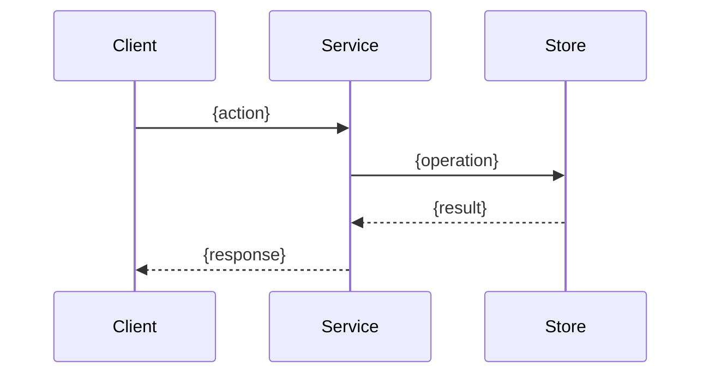

# Design: {Feature Name}

## Date
{ISO timestamp}

## Status
Proposed

## Original Request
{Verbatim developer request}

## Architecture Context
{Current system summary. Which components are affected. Existing constraints that shape the design.}

## Requirements

### Functional
- {requirement}

### Non-Functional
- Scale: {expected load, throughput}
- Latency: {acceptable response time}
- Reliability: {uptime, durability}
- Security: {concerns, compliance}

## Design

### Overview
{2-3 paragraph summary of the chosen approach and why it was selected.}

### Component Changes
- **{component}**: {changes and why}
- **{new component}** (new): {purpose and responsibilities}

### Data Flow

### Key Decisions
| Decision | Chosen | Over | Reasoning |
|----------|--------|------|-----------|
| {decision} | {option} | {alternatives} | {why} |

### Edge Cases & Failure Modes
- {case}: {handling strategy}

## Risk Records
| Risk | Severity | Mitigation | Accepted By |
|------|----------|------------|-------------|
| {risk description} | High/Medium/Low | {mitigation strategy} | {developer or architect} |

## Concepts Covered
- `{concept_id}`: {status} -- {summary}, grade: {1-4}

## Concepts to Explore During Implementation
- `{concept_id}`: {why relevant but not covered in this session}

## Migration & Rollback
- {migration steps}
- {rollback procedure}
- {data compatibility notes}

## Observability
- {key metrics to monitor}
- {alerting thresholds}
- {dashboards and logging}
